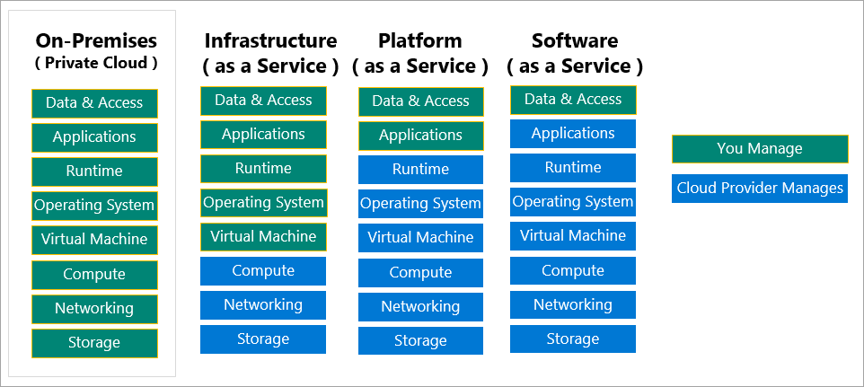

# Azure Fundamental Concepts

## **What are some cloud computing advantages?**

- High availability: Depending on the service-level agreement (SLA) that you choose, your cloud-based apps can provide a continuous user experience with no apparent downtime, even when things go wrong.
- Scalability: Apps in the cloud can scale vertically and horizontally:
- Scale vertically to increase compute capacity by adding RAM or CPUs to a virtual machine.
- Scaling horizontally increases compute capacity by adding instances of resources, such as adding VMs to the configuration.
- Elasticity: You can configure cloud-based apps to take advantage of autoscaling, so your apps always have the resources they need.
- Agility: Deploy and configure cloud-based resources quickly as your app requirements change.
- Geo-distribution: You can deploy apps and data to regional datacenters around the globe, thereby ensuring that your customers always have the best performance in their region.
- Disaster recovery: By taking advantage of cloud-based backup services, data replication, and geo-distribution, you can deploy your apps with the confidence that comes from knowing that your data is safe in the event of disaster.

## **Capital expenses vs. operating expenses**

- Capital Expenditure (CapEx) is the up-front spending of money on physical infrastructure, and then deducting that up-front expense over time. The up-front cost from CapEx has a value that reduces over time.
- Operational Expenditure (OpEx) is spending money on services or products now, and being billed for them now. You can deduct this expense in the same year you spend it. There is no up-front cost, as you pay for a service or product as you use it.

## Cloud computing type

- Private cloud
- Public cloud
- Hybrid cloud

## Cloud service model

- IaaS

    Infrastructure-as-a-Service

    This cloud service model is the closest to managing physical servers; a cloud provider will keep the hardware up-to-date, but operating system maintenance and network configuration is up to you as the cloud tenant. For example, Azure virtual machines are fully operational virtual compute devices running in Microsoft datacenters. An advantage of this cloud service model is rapid deployment of new compute devices. Setting up a new virtual machine is considerably faster than procuring, installing, and configuring a physical server.

- PaaS

    Platform-as-a-Service

    This cloud service model is a managed hosting environment. The cloud provider manages the virtual machines and networking resources, and the cloud tenant deploys their applications into the managed hosting environment. For example, Azure App Services provides a managed hosting environment where developers can upload their web applications, without having to worry about the physical hardware and software requirements.

- SaaS

    Software-as-a-Service

    In this cloud service model, the cloud provider manages all aspects of the application environment, such as virtual machines, networking resources, data storage, and applications. The cloud tenant only needs to provide their data to the application managed by the cloud provider. For example, Microsoft Office 365 provides a fully working version of Microsoft Office that runs in the cloud. All you need to do is create your content, and Office 365 takes care of everything else.

    
