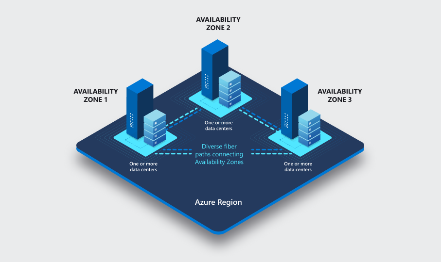

# Describe core Azure architectural components

## Learning objectives

After completing this module, you'll be able to describe the benefits and usage of:

- Azure regions, region pairs, and availability zones.
- Azure resources, resource groups, and Azure Resource Manager.
- Azure subscriptions and management groups.

- Resources: instances of services
- Resource groups: resources that are combined, act as a logical container. For example all this resources are part of dev, stage, prod.
- Subscriptions: groups together user accounts and resources that have been created for those user accounts. There are limits or quotas of resources. Organizations can use subscriptions to manage costs and resources that are created.
- Management groups: Helps to manage access, policy and compliance for multiple subscriptions.

### Azure regions

- Zonal services: You pin the resource to a specific zone (for example, VMs, managed disks, IP addresses).
- Zone-redundant services: The platform replicates automatically across zones (for example, zone-redundant storage, SQL Database.
- Non-regional services: Services are always available from Azure geographies and are resilient to zone-wide outages as well as region-wide outages.

#### Region pairs

Are azure regions interconnected, so one is the fallback of the another one.
For example: West US and East US.

## Availability Zones

- Azure availability zones are physically separate locations within each Azure region that are tolerant to local failures.
- Azure availability zones are connected by a high-performance network with a round-trip latency of less than 2ms.

## Azure resource groups

- Logical grouping
  - Life cycle
  - Authorization

- Tags

### Azure Resource Manager

## Azure Subscriptions

An Azure subscription is a logical unit of Azure services that links to an Azure account, which is an identity in Azure Active Directory (Azure AD) or in a directory that Azure AD trusts.

There are two types of subscription boundaries that you can use:

- Billing boundary
- Access control boundary

## Azure management groups

### Hierarchy of management groups and subscriptions

