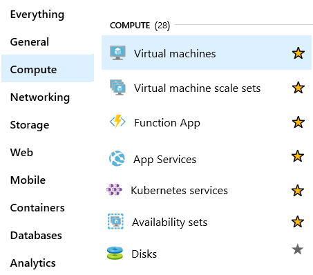

# Overview of Azure compute services

- Azure Virtual Machines
- Azure Container Instances
- Azure App Service
- Azure Functions (or serverless computing)

## Scale VMs in Azure

- Virtual machine scale sets
- Azure Batch -> Administrate VMs for performance
  - Starts a pool of compute VMs for you.
  - Installs applications and staging data.
  - Runs jobs with as many tasks as you have.
  - Identifies failures.
  - Requeues work.
  - Scales down the pool as work completes.

## Decide when to use Azure App Service

All of these app styles are hosted in the same infrastructure and share these benefits. This flexibility makes App Service the ideal choice to host web-oriented applications.

- Web apps
- API apps
- WebJobs
- Mobile apps

## Decide when to use Azure Container Instances or Azure Kubernetes Service

- Azure Container Services
- Azure Kubernetes Services

This is useful when we are talking about microservices.

## Decide when to use Azure Functions

- Abstraction of servers
- Event Driven
  - Timers, for example, if a function needs to run every day at 10:00 AM UTC.
  - HTTP, for example, API and webhook scenarios.
  - Queues, for example, with order processing.
- Micro-billing

### Azure implementations of Serverless

- Azure Functions: Functions can execute code in almost any modern language.
- Azure Logic Apps: Logic apps are designed in a web-based designer and can execute logic triggered by Azure services without writing any code.

## Decide when to use Azure Virtual Desktop

- Provide the best user experience
- Enhance security
