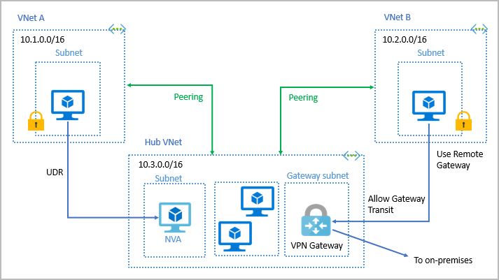
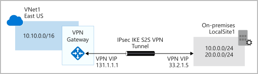
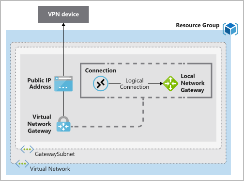
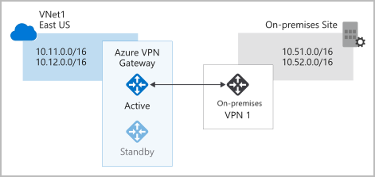
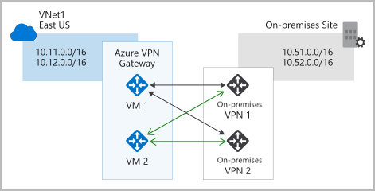

# Explore Azure networking services

## Azure Virtual Network fundamentals

Works in the same way that an on-premise network, allows:

    - Isolation and segmentation
    - Internet communications
    - Communicate between Azure resources
    - Communicate with on-premises resources
    - Route network traffic
    - Filter network traffic
    - Connect virtual networks

### Communicate between Azure resources

    - Virtual networks Virtual networks can connect not only VMs but other Azure resources, such as the App Service Environment for Power Apps, Azure Kubernetes Service, and Azure virtual machine scale sets.
    - Service endpoints You can use service endpoints to connect to other Azure resource types, such as Azure SQL databases and storage accounts. This approach enables you to link multiple Azure resources to virtual networks to improve security and provide optimal routing between resources.

### Communicate with on-premises resources

    - Point-to-site virtual private networks
    - Site-to-site virtual private networks
    - Azure ExpressRoute

### Example

# Azure Virtual Network settings

- Address spaces: You can add additional address spaces to the initial definition.
- Connected devices: View a list of all connected host in the virtual network.
- Subnets: You can add additional subnets.
- DDos protection: You can enable or disable the Standard DDos protection plan.
- Firewall: Configure firewall settings with Azure Firewall service for the virtual network.
- Security: Provides security recommendation you can apply to your virtual network.
- Network Manager: View connectivity and security admin configuration the virtual network is associated to.
- DNS servers: Configure internal or external DNS servers the resources in the virtual network will use.
- Peerings: Link virtual networks in peering arrangements.
- Service endpoints: Enable service endpoints and apply them to multiple subnets.
- Private endpoints: View a list of private endpoints enabled in a subnet.

# Azure VPN Gateway fundamentals

- Policy-based VPNs
- Route-based VPNs
  Use a route-based VPN gateway if you need any of the following types of connectivity:
  Connections between virtual networks
  Point-to-site connections
  Multisite connections
  Coexistence with an Azure ExpressRoute gateway

## Deploy a VPN Gateway

## High-availability scenarios

- Active/standby
    
- Active/active
    
- ExpressRoute failover
- Zone-redundant gateways

# Azure ExpressRoute fundamentals

Security considerations
With ExpressRoute, your data doesn't travel over the public internet, so it's not exposed to the potential risks associated with internet communications. ExpressRoute is a private connection from your on-premises infrastructure to your Azure infrastructure. Even if you have an ExpressRoute connection, DNS queries, certificate revocation list checking, and Azure Content Delivery Network requests are still sent over the public internet.