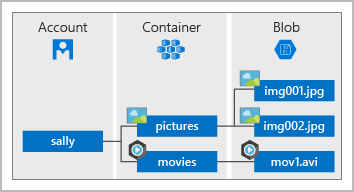
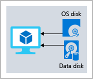

# Explore Azure Storage services

You have to create an Storage Account to manage all storage in Azure:

- blobs
- files
- disks
- NoSql documents
- queue messaging.

Depending on usage, exist three tiers:

- Hot: data accessed frequently
- Cold: for non constant use storage
- Archive: data rarely accessed

## Disk storage fundamentals

Disk Storage provides disks for Azure virtual machines

## Azure Blob storage fundamentals

- Serving images or documents directly to a browser.
- Storing files for distributed access.
- Streaming video and audio.
- Storing data for backup and restore, disaster recovery, and archiving.
- Storing data for analysis by an on-premises or Azure-hosted service.
- Storing up to 8 TB of data for virtual machines.

**You store blobs in containers, which helps you organize your blobs depending on your business needs.**

## Azure Files fundamentals

- Accessed via Server Message Block and Network File System.
- Can be mounted concurrently by cloud or on-premises deployments.

Use Azure Files for the following situations:

- Many on-premises applications use file shares. Azure Files makes it easier to migrate those applications that share data to Azure. If you mount the Azure file share to the same drive letter that the on-premises application uses, the part of your application that accesses the file share should work with minimal changes, if any.
- Store configuration files on a file share and access them from multiple VMs. Tools and utilities used by multiple developers in a group can be stored on a file share, ensuring that everybody can find them, and that they use the same version.
- Write data to a file share, and process or analyze the data later. For example, you might want to do this with diagnostic logs, metrics, and crash dumps.

One thing that distinguishes Azure Files from files on a corporate file share is that you can access the files from anywhere in the world, by using a URL that points to the file. You can also use Shared Access Signature (SAS) tokens to allow access to a private asset for a specific amount of time.

## Understand Blob access tiers

Depending on data lifecycle, Azure provide different tiers depending on data access frequency

- Hot access tier: Optimized for storing data that is accessed frequently (for example, images for your website).
- Cool access tier: Optimized for data that is infrequently accessed and stored for at least 30 days (for example, invoices for your customers).
- Archive access tier: Appropriate for data that is rarely accessed and stored for at least 180 days, with flexible latency requirements (for example, long-term backups).

