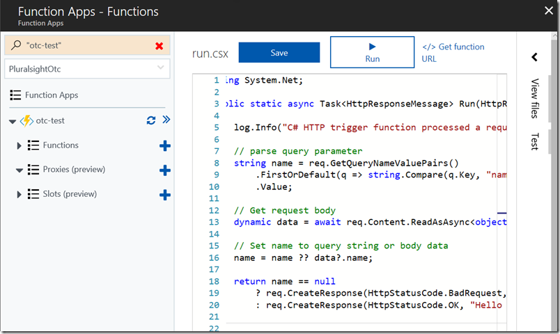
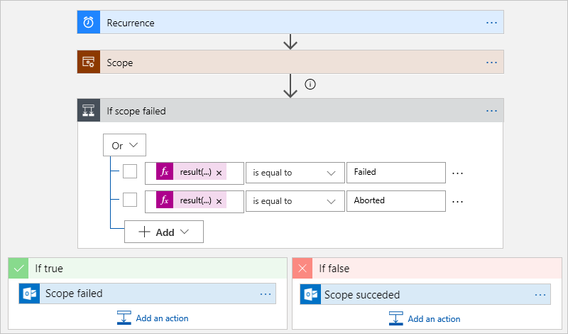

# Choose the best Azure serverless technology for your business scenario

## **Identify the product options**

Serverless computing is a cloud-hosted execution environment that runs your code but abstracts the underlying hosting environment.

### Azure Functions

  

- His use is related to respond **events** and when work can be done quickly, within seconds or less.
- Can host a single method of a programming language of your choice.
- Functions can be written in many common programming languages, such as C#, Python, JavaScript, Typescript, Java, and PowerShell.
- Functions scales automatically
- Function are stateless, if state is required the function can be connected to an Azure storage account.
- Durable Functions allow developers chain functions together maintaining state.

### Azure Logic Apps

  

- Low code/no-code development platform.
- Helps you to automate and orchestrate task, business process and workflows.
- More than 200 connectors provided by Azure and third party Services.
- You can build your own connector as business need by using custom code.

### What are the differences between these services?

- Both can work together: you can call Azure Functions from Azure Logic Apps and vice versa.
- Azure Functions is designed to compute.
- Azure Logic Apps is mainly designed to orchestrate process.
- Pricing is different: Azure Functions is based on running time and Azure Logic Apps is based on the number of executions and connectors it utilizes

## **Analyze the decision criteria**

- Do you need to perform an orchestration across well-known APIs?
  - Use Azure Logic Apps
  - Could use Azure Functions but requires more time
- Do you need to execute custom algorithms or perform specialized data parsing and data lookups?
  - Use Azure Functions
  - Could use Azure Logic Apps but it could be more verbose and visually overwhelming
- Do you have existing automated tasks written in an imperative programming language?
  - Use Azure Functions importing code into Azure Body Function
- Do you prefer a visual (declarative) workflow or writing (imperative) code?
  - If you prefer a visual declarative workflow use Azure Logic Apps
  - If you prefer writing code use Azure Functions
