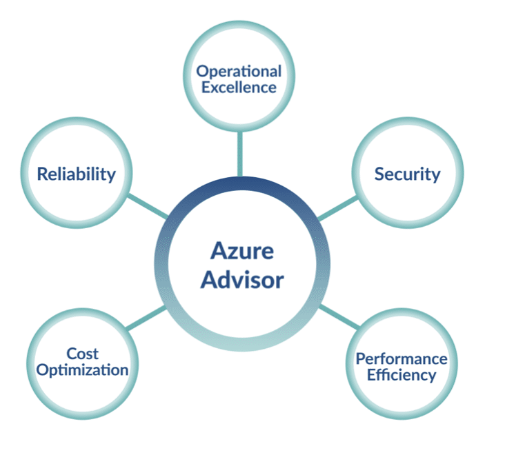
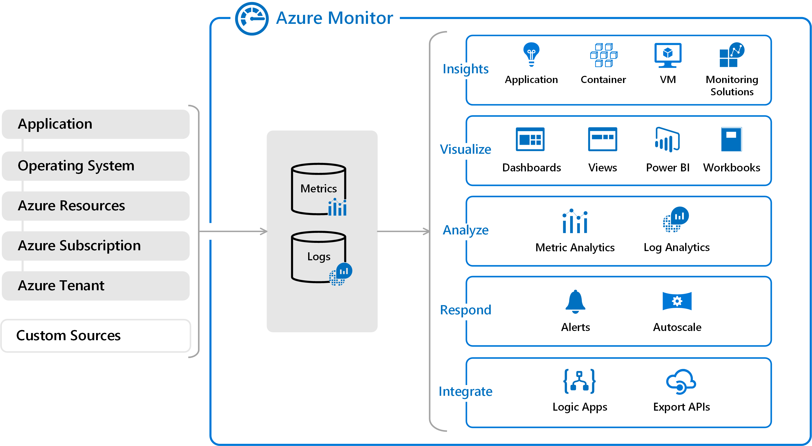
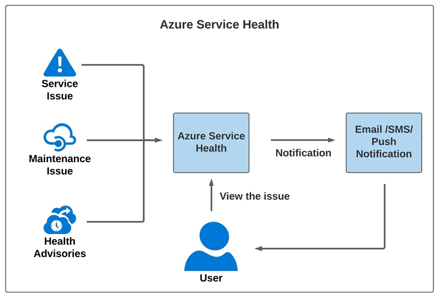

# Choose the best monitoring service for visibility, insight, and outage mitigation

Azure provides tools for gaining visibility into health and performance of Azure Resources. These helps you to react quickly to outages, research issues, optimize usage and handle efficiently future planned downtimes.

## **Identify the product options**

### Azure Advisor

- Evaluate your Azure resources and provides recommendations to help improve reliability, security, performance, achieve operational excellence and reduce costs.
- These recommendations can be taken right away, postponed, dismissed.
- Recommendations are available via Azure Portal and the API, you can set alarms to new recommendations
- You can use filter to see recommendations per subscription, resource group or services.
- Recommendations are divided into five categories: Reliability, Security, Performance, Cost and Operational Excellence.

### Azure Monitor

- Platform to collect, analyze, visualize and take potential actions based on the metric and logging data from your entire resources

#### Azure Monitor Diagram

On left you can appreciate all data sources, in the center are the central repositories for Metrics and Logs and on the right are all the applications that Azure Provide through Azure Monitor.

- You can use data to react to critical events in real time: sending email or SMS alerts to your team or configuring triggers based on thresholds to scale up or down to meet demand
- There are some services who uses Azure Monitor under hood, for example Azure Application Insights

#### **Application Insights**

- Automatically detect performance anomalies.
- Help diagnose issues by using powerful analytics tools.
- See what users actually do with apps.
- Help continuously improve app performance and usability.
- Supports a wide variety of platforms, including .NET, Node.js, Java, and Python.
- Works for apps hosted on-premises, hybrid, or on any public cloud.
- Integrates with DevOps processes.
- Has connection points to many development tools.
- Can monitor and analyze telemetry from mobile apps by integrating with Visual Studio App Center.

### Azure Service Health

- Provides a personalized view of the health of Azure Services, regions and resources you rely on
- You can set up alerts that help you triage outages and **planned maintenance**.
- Helps you to keep an eye on several event types: Service issues, Planned maintenance and Health advisories

## **Analyze the decision criteria**

- Do you need to analyze how you're using Azure to reduce costs, improve resilience, or harden your security?
  - Choose Azure Advisor
- Do you want to monitor Azure services or your usage of Azure?
  - If you want to keep tabs **on Azure itself**, especially the services and regions you depend on, then use **Azure Service Health**
  - If you want to keep track of the performance or issues related to **your resources**, then use **Azure Monitor**
- Do you want to measure custom events alongside other usage metrics?
  - Choose Azure Monitor
- Do you need to set up alerts for outages or when autoscaling is about to deploy new instances?
  - You would use Azure Monitor to set up alerts for key events that are related to your specific resources.
