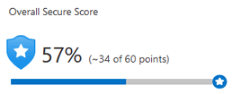
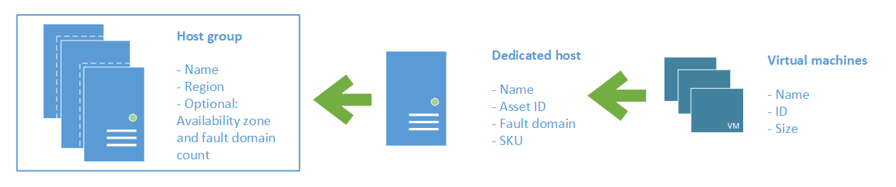

# Protect against security threats on Azure

- Security is a small word for a significant concept
- There are so many factors to consider in order to protect your apps and data
  
After completing this module, you'll be able to:

- Strengthen your security posture and protect against threats by using Azure Security Center.
- Collect and act on security data from many different sources by using Azure Sentinel.
- Store and access sensitive information such as passwords and encryption keys securely in Azure Key Vault.
- Manage dedicated physical servers to host your Azure VMs for Windows and Linux by using Azure Dedicated Host.

## **Azure Security Center**

- Is a monitoring service that provides visibility of your security posture across all your services
- Security posture refers to cibersecurity policies and controls

With Azure Security Center you can:

- **Monitor security settings** across on-premises and cloud workloads.
- **Automatically apply required security settings** to new resources as they come online.
- **Provide security recommendations** based on actual state
- **Perform automatic security assessments** to identify potential vulnerabilities before those vulnerabilities can be exploited.
- Use machine learning to **detect and block malware** from being installed on your virtual machines (VMs) and other resources.
- You can use **adaptive application controls** to define rules that list allowed applications to ensure that only applications you allow can run.
- **Detect and analyze potential inbound attack**s and investigate threats and any post-breach activity that might have occurred.
- **Provide just-in-time access control for network ports**. Doing so reduces your attack surface by ensuring that the **network only allows traffic that you require at the time that you need it** to.
- **File integrity monitoring**: monitoring of changes to important files on both Windows and Linux, registry settings, applications, and other aspects that might indicate a security attack

### Secure score



- Your score is based on the percentage of security controls that you satisfy
- The more security controls you satisfy, the higher the score you receive
- Report on the current state of your organization's security posture
- Improve your security posture by providing discoverability, visibility, guidance, and control
- Compare with benchmarks and establish key performance indicators (KPIs)

### Respond to security alerts

Security Center provides a centralized view of all security alerts, using Security Center connector and Azure Logic Apps you can build a workflow who detect anomalies and send you alerts across multiple channels.

## **Azure Sentinel**

- Security Information and Event Management (SIEM)
- Azure Sentinel is Microsoft's cloud-based SIEM system

Azure sentinel enables you to:

- **Collect cloud data** at scale Collect data across all users, devices, applications, and infrastructure, both on-premises and from multiple clouds.
- **Detect previously undetected threats** Minimize false positives by using Microsoft's comprehensive analytics and threat intelligence.
- **Investigate threats with artificial intelligence** Examine suspicious activities at scale, tapping into years of cybersecurity experience from Microsoft.
- **Respond to incidents rapidly** Use built-in orchestration and automation of common tasks.

### Connect your data sources

Azure Sentinel supports a number of data sources, which it can analyze for security events.

- Connect Microsoft solutions
- Connect other services and solutions
- Connect industry-standard data sources

### Detect threats

- Built in analytics: templates or predefined rules to detect threats
- Custom analytics: you create your specific criteria to detect threats

### Investigate and respond

- Azure Sentinel provides you a graph with all entities related into alert
- You could use Azure Monitor Workbooks to automate responses to threats
- Workbooks can be run manually or automatically when a rule triggers an alert

## **Azure Key Vault**

- Azure Key Vault is a centralized cloud service for storing an application's secrets in a single, central location
- It provides secure access to sensitive information by providing access control and logging capabilities

Azure Key Vault can help you:

- **Manage secrets** You can use Key Vault to securely store and tightly control access to tokens, passwords, certificates, API keys, and other secrets.
- **Manage encryption keys** You can use Key Vault as a key management solution. Key Vault makes it easier to create and control the encryption keys that are used to encrypt your data.
- **Manage SSL/TLS certificates** Key Vault enables you to provision, manage, and deploy your public and private Secure Sockets Layer/Transport Layer Security (SSL/TLS) certificates for both your Azure resources and your internal resources.
- **Store secrets backed by hardware security modules** (HSMs) These secrets and keys can be protected either by software or by FIPS 140-2 Level 2 validated HSMs.

The benefits of using Key Vault include:

- **Centralized application secrets** reduces the chances that secrets are accidentally leaked.
- Securely stored secrets and keys Azure uses industry-standard algorithms, key lengths, and HSMs.
- Access to Key Vault requires proper authentication and authorization.
- You can monitor and control access to your application secrets.
- **Simplified administration of application secrets** Key Vault makes it easier to enroll and renew certificates from public certificate authorities (CAs).
- You can also scale up and replicate content within regions and use standard certificate management tools.
- **Integration with other Azure services**

```bash
az keyvault secret show \
    --name MyPassword \
    --vault-name my-keyvault-1139 \
    --query value \
    --output tsv
```

## **Azure Dedicated Host**

- Some organizations must follow regulatory compliance that requires them **to be the only customer using the physical machine that hosts their virtual machines**



Azure Dedicated Host:

- Gives you visibility into, and control over, the server infrastructure that's running your Azure VMs.
- Helps address compliance requirements by deploying your workloads on an isolated server.
- Lets you choose the number of processors, server capabilities, VM series, and VM sizes within the same host.
- For high availability, you can provision multiple hosts in a host group, and deploy your VMs across this group
- Pricing considerations
  - You're charged per dedicated host, independent of how many VMs you deploy to it.
  - The host price is based on the VM family, type (hardware size), and region.
  - Software licensing, storage, and network usage are billed separately from the host and VMs.
