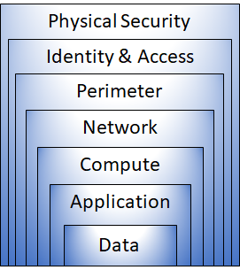
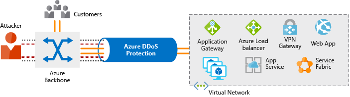

# Secure network connectivity on Azure

After completing this module, you'll be able to:

- Identify the layers that make up a defense in depth strategy.
- Explain how Azure Firewall enables you to control what traffic is allowed on the network.
- Configure network security groups to filter network traffic to and from Azure resources within a Microsoft Azure virtual network.
- Explain how Azure DDoS Protection helps protect your Azure resources from DDoS attacks.

## **Basic concepts**

### Layers of defense in depth

- The physical security layer is the first line of defense to protect computing hardware in the datacenter.
- The identity and access layer controls access to infrastructure and change control.
- The perimeter layer uses distributed denial of service (DDoS) protection to filter large-scale attacks before they can cause a denial of service for users.
- The network layer limits communication between resources through segmentation and access controls.
- The compute layer secures access to virtual machines.
- The application layer helps ensure that applications are secure and free of security vulnerabilities.
- The data layer controls access to business and customer data that you need to protect.

### Security posture

- Confidentiality
  - The principle of least privilege means restricting access to information only to individuals explicitly granted access
- Integrity
  - Prevent unauthorized changes to information:
    At rest: when it's stored.
    In transit: when it's being transferred from one place to another, including from a local computer to the cloud
- Availability:
  - Ensure that services are functioning and can be accessed only by authorized users. Denial-of-service attacks are designed to degrade the availability of a system, affecting its users.

## **Azure Firewall**

A firewall is a network security device that monitors incoming and outgoing network traffic and decides whether to allow or block specific traffic based on a defined set of security rules.

Your rules can specified:

- Range of IP addresses
- Specific network protocols and ports

Azure Firewall provides many features, including:

- Built-in high availability.
- Unrestricted cloud scalability.
- Inbound and outbound filtering rules.
- Inbound Destination Network Address Translation (DNAT) support.
- Azure Monitor logging.

> **Azure Application Gateway** also provides a firewall that's called the web application firewall (WAF). WAF provides centralized, inbound protection for your web applications against common exploits and vulnerabilities. **Azure Front Door** and **Azure Content Delivery Network** also provide WAF services.

## **Azure DDoS Protection**

- DDoS Protection identifies the attacker's attempt to overwhelm the network and blocks further traffic from them
- Legitimate traffic from customers still flows into Azure without any interruption of service

### **Basic service tier**

- The Basic service tier ensures that Azure infrastructure itself is not affected during a large-scale DDoS attack.
- The Azure global network is used to distribute and mitigate attack traffic across Azure regions.

### **Standard service tier**

- The Standard tier provides always-on traffic monitoring and real-time mitigation of common network-level attacks. It provides the same defenses that Microsoft's online services use.
- Protection policies are tuned through dedicated traffic monitoring and machine learning algorithms.
- Policies are applied to public IP addresses, which are associated with resources deployed in virtual networks such as Azure Load Balancer and Application Gateway.
- The Azure global network is used to distribute and mitigate attack traffic across Azure regions.

Azure DDos Protection standard tier help to prevent:
**Volumetric attacks, Protocol attacksResource-layer (application-layer) attacks (only with web application firewall)**.

## **Network Security Groups**

- Works as an internal firewall, preventing attacker inside an Azure Virtual Network
- An NSG can contain multiple inbound and outbound security rules that enable you to filter traffic to and from resources by source and destination IP address, port, and protocol.
- When you create a network security group, Azure creates a series of default rules to provide a baseline level of security. You can't remove the default rules, but you can override them by creating new rules with higher priorities.

## **Combine Azure services to create a complete network security solution**

### Secure the perimeter layer

- Use Azure DDoS to filter large scale attacks
- Use perimeter firewall to identify and alert malicious attacks against your network

### Secure the network

- Use network security groups to protect internal network
- Limit communication between resources by segmenting your network and configuring access controls.
- Deny by default.
- Restrict inbound internet access and limit outbound where appropriate.
- Implement secure connectivity to on-premises networks.

### Combine services

- Network security groups and Azure Firewall
- Azure Application Gateway web application firewall and Azure Firewall
