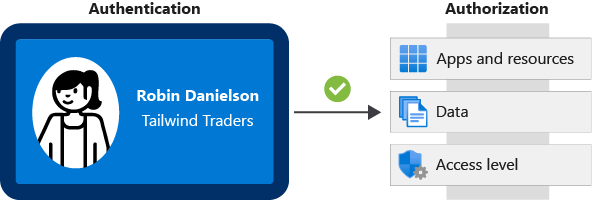
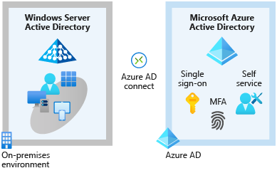
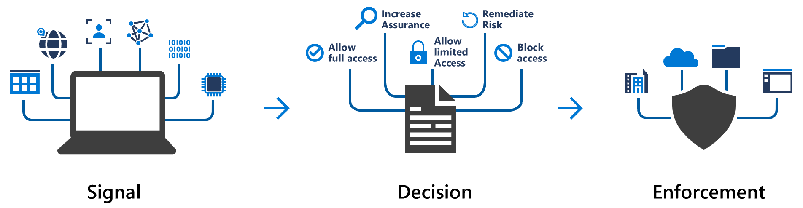

# Secure access to your applications by using Azure identity services

## **Concepts**

### **What is authentication?**

Authentication is the process of **establishing** the **identity of a person** or **service** that wants to access a resource. It involves the act of challenging a party for legitimate credentials and provides the basis for creating a security principal for identity and access control. It establishes whether the user is who they say they are.

### **What is authorization?**

Is the process of **establishing** what **level of access** an **authenticated person** or **service** has

### **What is Single sign-on SSO?**

- Enables a user to sign-on one time and use that credential to access multiple resources and application from different providers
- The more passwords a user has to manage, the greater the risk of a credential-related security incident.
- Using SSO for accounts makes it easier for users to manage their identities and increases your security capabilities.

### **What's multifactor authentication?**

- Is a process where a user is prompted during the sign-in process for an additional form of identification
- These elements fall into three categories:
  - Something the user knows
  - Something the user has
  - Something the user is
- Multifactor authentication increases identity security by limiting the impact of credential exposure (for example, stolen usernames and passwords).

## **Azure Active Directory**

- Provides identity services that enable your users to sign in and access both Microsoft cloud applications and cloud applications that you develop
- **Active Directory is not exactly the same than Azure AD**, first one run on-premise
- Azure AD is cloud-based identity and access management service
- You can connect Active Directory to Azure AD for free to provide some extra features
- Azure AD is used for: IT administrators, App Developers, Users, Online services subscribers
- Azure Active Directory provides services such as:
  - Authentication
  - Single sign-on (SSO)
  - Application management
  - Device Management

- To connect on-premise Active Directory to Azure AD you can use Azure AD connect
  

## **Azure AD Multi-Factor**

- Is a Microsoft service that provides multifactor authentication capabilities
- These services provide Azure AD Multi-Factor Authentication capabilities:
  - Azure Active Directory
  - Multifactor authentication for Office 365

### Conditional Access

- Conditional Access is a tool that Azure Active Directory uses to allow (or deny) access to resources based on identity signals
- Empower users to be productive wherever and whenever.
- Protect the organization's assets.
- To use Conditional Access, you need an Azure AD Premium P1 or P2 license. If you have a Microsoft 365 Business Premium license, you also have access to Conditional Access features.

Conditional Access is useful when you need to:

- Require multifactor authentication to access an application.
- Require access to services only through approved client applications.
- Require users to access your application only from managed devices.
- Block access from untrusted sources, such as access from unknown or unexpected locations.

***What if tool*** help you to test conditional access.
