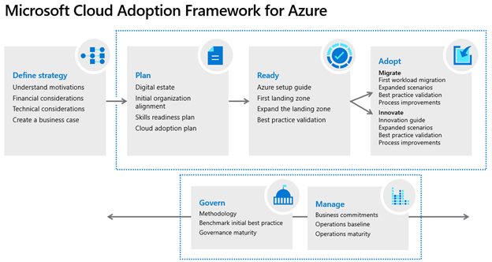

# Build a cloud governance strategy on Azure

## **Control access to cloud resources by using Azure role-based access control (Azure RBAC)**

- Each role has an associated set of access permissions that relate to that role
- Azure provides built-in roles that describe common access rules for cloud resources
- You can also define your own roles
- Role-based access control is applied to a ***scope***, which is a resource or set of resources that this access applies to.
- You manage RBAC permissions in the ***Azure Portal > Access Control (IAM)***

Scopes include:

- A management group (a collection of multiple subscriptions).
- A single subscription.
- A resource group.
- A single resource.

## **Resource Locks**

- A resource lock prevents resources from being accidentally deleted or changed.
- Think of a resource lock as a warning system that reminds you that a resource should not be deleted or changed.
- You can manage resource locks from the Azure portal, PowerShell, the Azure CLI, or from an Azure Resource Manager template.
- To view, add, or delete locks in the Azure portal, go to the Settings section of any resource's Settings pane in the Azure portal.
- You can apply locks to a subscription, a resource group, or an individual resource.
- **CanNotDelete** means authorized people can still read and modify a resource, but they can't delete the resource without first removing the lock.
- **ReadOnly** means authorized people can read a resource, but they can't delete or change the resource. Applying this lock is like restricting all authorized users to the permissions granted by the Reader role in Azure RBAC.
- **To modify a locked resource, you must first remove the lock**.
- Even if you're an owner of the resource, you must still remove the lock before you can perform the blocked activity.

## **Resource Tags**

- Tags provide extra information, or metadata, about your resources.
- Metadata is useful to
  - Resource management
  - Cost management and optimization
  - Operations management
  - Security
  - Governance and regulatory compliance
  - Workload optimization and automation
- You can add, modify, or delete resource tags through PowerShell, the Azure CLI, Azure Resource Manager templates, the REST API, or the Azure portal.
- You can use **Azure Policy** to ensure that a resource inherits the same tags as its parent resource group
- You can also use **Azure Policy** to enforce tagging rules and conventions

## **Azure Policy**

- Azure Policy is a service in Azure that enables you to create, assign, and manage policies that control or audit your resources.
- Azure Policy enables you to define:
  - **Individual policies**
  - **Initiatives** which are a group of related policies
- Azure Policy evaluates your resources and highlights resources that aren't compliant with the policies you've created
- Azure Policy can also prevent noncompliant resources from being created.
- Azure Policy comes with built-in policy and initiative definitions for Storage, Networking, Compute, Security Center, and Monitoring
- Azure Policy also integrates with Azure DevOps by applying any continuous integration and delivery pipeline policies that pertain to the pre-deployment and post-deployment phases of your applications.

Implementing a policy in Azure Policy involves three tasks:

1. Create a policy definition.
2. Assign the definition to resources.
3. Review the evaluation results.

## **Azure Blueprints**

- Design to govern multiple subscriptions
- With Azure Blueprints you can define a repeatable set of governance tools and standard Azure resources that your organization requires
- Each component in the blueprint definition is known as an **artifact**.

Azure Blueprints orchestrates the deployment of various resource templates and other artifacts, such as:

- Role assignments
- Policy assignments
- Azure Resource Manager templates
- Resource groups

Implementing a blueprint in Azure Blueprints involves these three steps:

1. Create an Azure blueprint.
2. Assign the blueprint.
3. Track the blueprint assignments.

## **Cloud Adoption Framework for Azure**

The Cloud Adoption Framework includes these stages:

1. Define your strategy.
2. Make a plan.
3. Ready your organization.
4. Adopt the cloud.
5. Govern and manage your cloud environments.

## **Create a subscription governance strategy**

- Teams often start their Azure governance strategy at the subscription level.
- There are three main aspects to consider when you create and manage subscriptions: billing, access control, and subscription limits.

### Billing

- You can create one billing report per subscription
- If you have multiple departments and need to do a "chargeback" of cloud costs, one possible solution is to organize subscriptions by department or by project
- Resource tags can also help
- When you define how many subscriptions you need and what to name them, take into account your internal billing requirements.

### Access Control

- A subscription is a deployment boundary for Azure resources
- Every subscription is associated with an Azure Active Directory tenant
- Each tenant provides administrators the ability to set granular access through defined roles by using Azure role-based access control
- With separate subscriptions, you can control access to each one separately and isolate their resources from one another.

### Subscription limits

- Subscriptions also have some resource limitations.
- Those limits should be considered during your design phase
- Management groups are also available to assist with managing subscriptions
