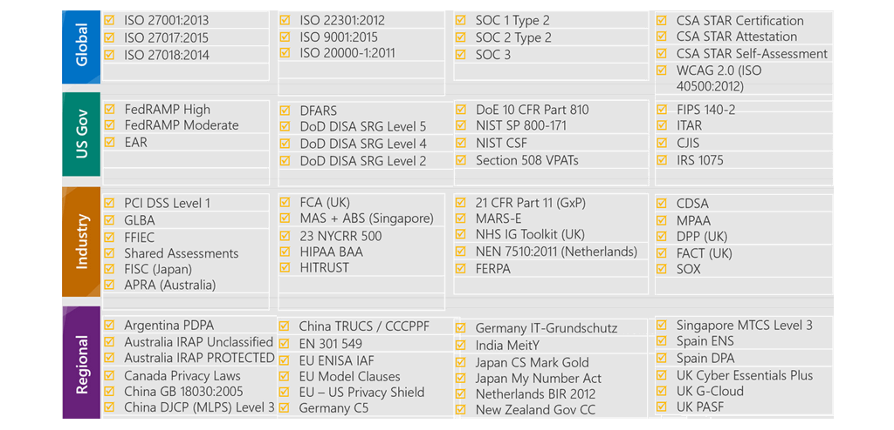

# Examine privacy, compliance, and data protection standards on Azure

## **Explore compliance terms and requirements**

- Criminal Justice Information Service
- Cloud Security Alliance STAR Certification
- European Union Model Clauses
- Health Insurance Portability and Accountability Act
- International Organization of Standards/International Electrotechnical Commission 27018
- Multi-Tier Cloud Security Singapore
- Service Organization Controls 1, 2, and 3
- National Institute of Standards and Technology Cybersecurity Framework
- United Kingdom Government G-Cloud

## **Access the Microsoft Privacy Statement, the Online Services Terms, and the Data Protection Addendum**

- The Microsoft Privacy Statement explains what personal data Microsoft collects, how Microsoft uses it, and for what purposes.
- The Online Services Terms (OST) is a legal agreement between Microsoft and the customer. The OST details the obligations by both parties with respect to the processing and security of customer data and personal data.
- The Data Protection Addendum (DPA) further defines the data processing and security terms for online services
  - Compliance with laws.
  - Disclosure of processed data.
  - Data Security, which includes security practices and policies, data encryption, data access, customer responsibilities, and compliance with auditing.
  - Data transfer, retention, and deletion.

## **Explore the Trust Center**

The Trust Center showcases Microsoft's principles for maintaining data integrity in the cloud and how Microsoft implements and supports security, privacy, compliance, and transparency in all Microsoft cloud products and services.

The Trust Center provides:

- In-depth information about security, privacy, compliance offerings, policies, features, and practices across Microsoft cloud products.
- Additional resources for each topic.
- Links to the security, privacy, and compliance blogs and upcoming events.

## **Access Azure compliance documentation**

The Azure compliance documentation provides you with detailed documentation about legal and regulatory standards and compliance on Azure.

Here you find compliance offerings across these categories:

- Global
- US government
- Financial services
- Health
- Media and manufacturing
- Regional

## **Azure Government**

- Azure Government is a separate instance of the Microsoft Azure service
- It addresses the security and compliance needs of US federal agencies, state and local governments, and their solution providers.
- Azure Government offers **physical isolation** from non-US government deployments and provides screened US personnel
- To provide the highest level of security and compliance, Azure Government uses physically isolated datacenters and networks located only in the US
- Azure Government is available in eight geographies and offers the most compliance certifications of any cloud provider

## **Azure China 21Vianet**

- It's a physically separated instance of cloud services located in China.
- Azure China 21Vianet is independently operated and transacted by Shanghai Blue Cloud Technology Co
- According to the China Telecommunication Regulation, providers of cloud services, infrastructure as a service (IaaS) and platform as a service (PaaS), must have value-added telecom permits
- Only locally registered companies with less than 50 percent foreign investment qualify for these permits
- The Azure services are based on the same Azure, Office 365, and Power BI technologies that make up the Microsoft global cloud service, with comparable service levels.
- Azure includes the core components of IaaS, PaaS, and software as a service (SaaS). These components include network, storage, data management, identity management, and many other services.
- Azure China 21Vianet supports most of the same services that global Azure has, such as geosynchronous data replication and autoscaling
- Even if you already use global Azure services, to operate in China you might need to rehost or refactor some or all your applications or services.

## **Summary**

- The Microsoft Privacy Statement provides trust in how Microsoft collects, protects, and uses customer data.
- The Trust Center provides you with documentation about compliance standards and how Azure can support your business.
- The Azure compliance documentation includes detailed information about legal and regulatory standards and compliance on Azure.
