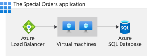

# Choose the right Azure services by examining SLAs and service lifecycle

- A **service-level agreement** (SLA) is a formal agreement between a service company and the customer, this agreement **defines** the **performance standards** that Microsoft commits to for you, the customer.
- A typical SLA breaks down into these sections:
  - Introduction
  - General terms
  - SLA details

## **How do percentages relate to total downtime?**

- Downtime refers to the time duration that the service is unavailable.
- The difference between 99.9 percent and 99.99 percent might seem minor, but it's important to understand what these numbers mean in terms of total downtime.
- A service credit is the percentage of the fees you paid that are credited back to you according to the claim approval process.
- An SLA describes how Microsoft responds when an Azure service fails to perform to its specification
- Free products typically don't have an SLA.
- **Azure status** provides a global view of the health of Azure services and regions. If you suspect there's an outage, this is often a good place to start your investigation.

## **Design your application to meet your SLA**

### **Identify your workloads**

A workload is a distinct capability or task that's logically separated from other tasks, in terms of business logic and data storage requirements

### **Combine SLAs to compute the composite SLA**

From Service Level Agreements, you discover the SLA for each Azure service that you need. They are:

- Azure Load Balancer SLA = 99.99%
- Azure SQL Database SLA = 99.99%
- Azure Virtual Machine SLA = 99.9%

99.9% × 99.9% × 99.99% × 99.99%

= 0.999 × 0.999 × 0.9999 × 0.9999
= 0.9978
= **99.78 %**

### **What happens when the composite SLA doesn't meet your needs?**

- Choose customization options that fit your required SLA
- Build **availability** requirements into your design
- Include **redundancy** to increase availability

> Performance targets above 99.99 percent are very difficult to achieve. An SLA of 99.99 percent means 1 minute of downtime per week. It's difficult for humans to respond to failures quickly enough to meet SLA performance targets above 99.99 percent. Instead, your application must be able to self-diagnose and self-heal during an outage.

## **Access preview services and preview features**

### **Service Lifecycle**

- Development phase
- Public-preview phase
- Production-ready phase - General Availability (GA)

> - _Each Azure preview defines its own terms and conditions._
> - _You can access preview services from the Azure portal._
> - _The Azure updates page provides information about the latest updates to Azure products, services, and features, and product roadmaps and announcements._
