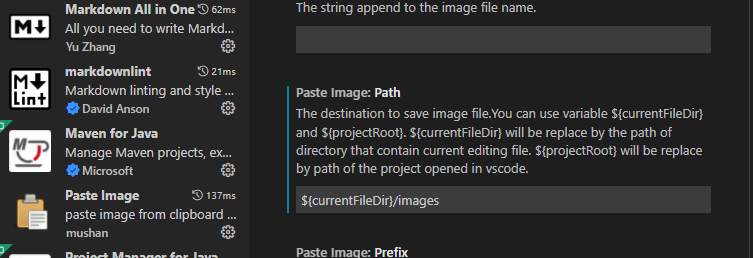

# AZ900 Fundamentals Resume

In this repository you will find a resume of all content available in [Microsoft Azure Fundamentals: Describe core Azure concepts](https://docs.microsoft.com/en-us/learn/paths/az-900-describe-cloud-concepts/).

> This is resume is wrote in Markdown, you can found basic syntax [here](https://www.markdownguide.org/basic-syntax/).

To copy paste you could use an Visual Studio Code Extension [Paste Image](https://marketplace.visualstudio.com/items?itemName=sakamoto66.vscode-paste-image), configure extension to paste directly into _images_ folder.

